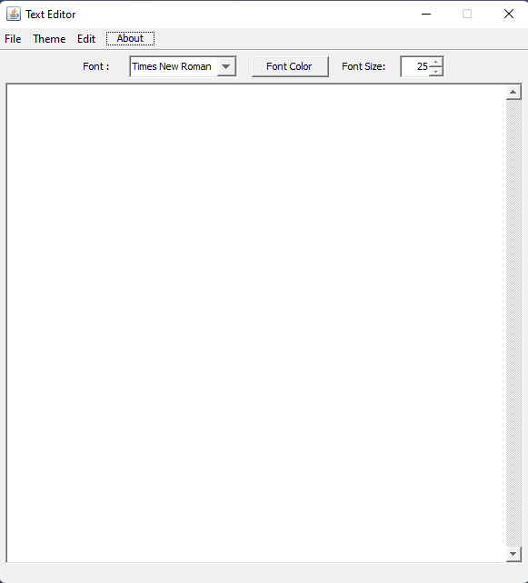
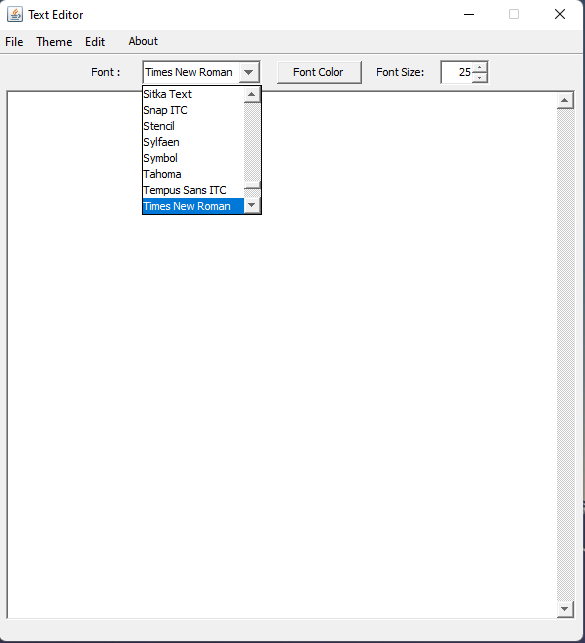
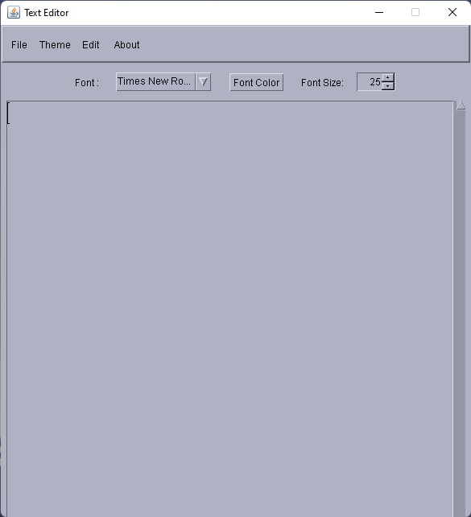
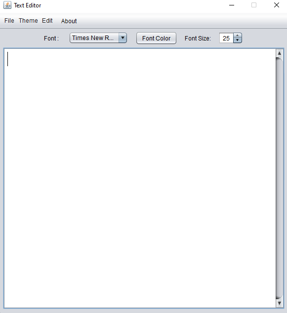
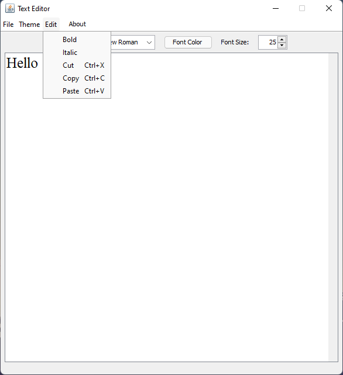
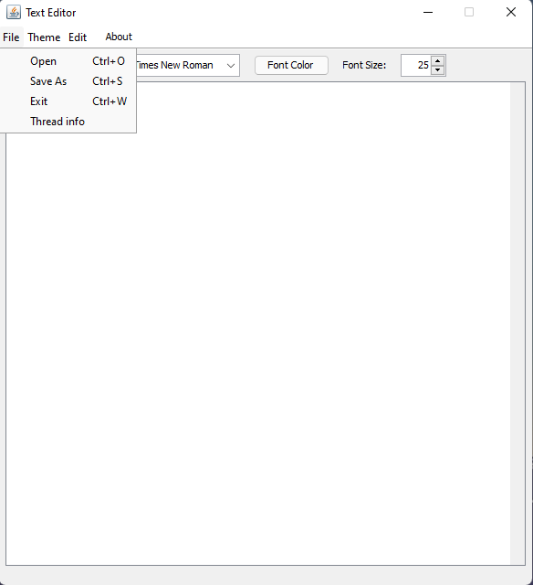
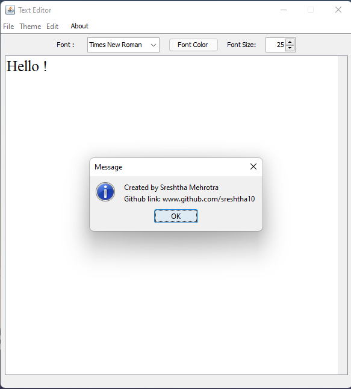

# Text Editor
Text editor created using Java.

## Requirements

* JRE 1.4 and above.

## Screenshots

<table>
  <tr>
    <td></td>
    <td></td>
  
  </tr>
    <tr>
    <td></td>
    <td></td>
  </tr>
   <tr>
   <td></td>
    <td></td>
  </tr>
  <tr>
    <td></td>
  </tr>
 </table>

## LICENSE - MIT License